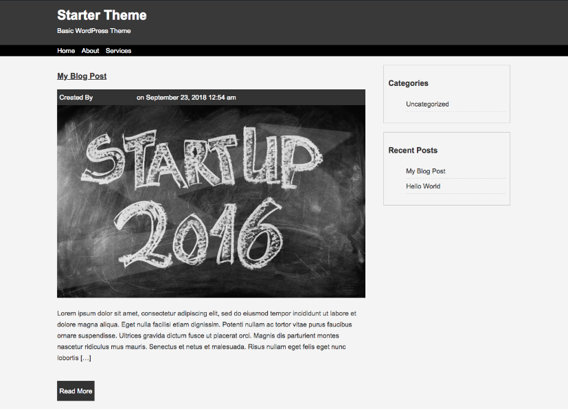

# [WordPress Starter Theme](https://github.com/costaleonardo/wordpress-starter-theme)

> This starter theme is a basic theme built from the [Learn To Create WordPress Themes By Building 10 Projects](https://www.udemy.com/learn-to-create-wordpress-themes-by-building-10-projects/) course. It goes through the basics of creating WordPress themes by setting up the necessary files and managing the content through the local WordPress dashboard.

## Preview

## Download and Installation

To begin using this theme, choose one of the following options to get started:

* Clone the repo: `git clone https://github.com/costaleonardo/wordpress-starter-theme.git`
* [Fork, Clone, or Download on GitHub](https://github.com/costaleonardo/wordpress-starter-theme)

## Bugs and Issues

Have a bug or an issue with this template? [Open a new issue](https://github.com/costaleonardo/wordpress-starter-theme/issues) here on GitHub.

## Copyright and License

This project is licensed under the [MIT](https://opensource.org/licenses/MIT) License.
